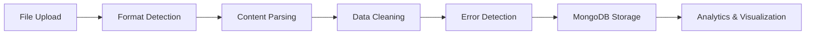

# 🔄 VizFlow - Data Processing & Visualization Platform

VizFlow is a comprehensive full-stack application designed to handle messy data from multiple formats (PDF, CSV, XML, JSON, Images), clean and validate it, and provide powerful visualization and analytics capabilities.

## 🌟 Features

### 📁 **Multi-Format Data Processing**
- **PDF Processing**: Text extraction with OCR support using Tesseract.js
- **CSV Parsing**: Automatic delimiter detection and structured data extraction
- **JSON/XML**: Nested object flattening and structure parsing
- **Image OCR**: Text extraction from PNG, JPG, JPEG files
- **Intelligent Parsing**: Context-aware data structure detection

### 🧹 **Advanced Data Cleaning & Validation**
- **Type Detection**: Automatic detection of emails, phones, dates, numbers, URLs
- **Data Normalization**: Consistent formatting and standardization
- **Duplicate Removal**: Smart duplicate detection and elimination
- **Validation Engine**: Field requirement validation and format checking
- **Error Categorization**: Missing fields, invalid formats, duplicates, validation errors

### 📊 **Rich Analytics & Visualization**
- **Interactive Charts**: Error distribution, file type analysis, trend visualization
- **Real-time Dashboards**: System health, processing metrics, data quality scores
- **Performance Analytics**: Processing times, success rates, error patterns
- **Data Insights**: Quality metrics, improvement recommendations

### 💾 **Flexible Data Export**
- **Multiple Formats**: Download cleaned data as CSV, JSON, or XML
- **Bulk Export**: Download all processed data in one operation
- **Custom Filtering**: Export specific subsets of data
- **API Access**: Programmatic data access via REST API

### 🎯 **Professional UI/UX**
- **Modern Design**: Clean, intuitive interface built with Tailwind CSS v3
- **Responsive Layout**: Works seamlessly on desktop, tablet, and mobile
- **Drag & Drop Upload**: Intuitive file upload with progress tracking
- **Real-time Updates**: Live progress and status updates
- **Advanced Search**: Powerful filtering and search capabilities

## 🏗️ Architecture

```
VizFlow/
├── backend/                 # Node.js + Express API
│   ├── src/
│   │   ├── routes/         # API endpoints
│   │   ├── services/       # Business logic
│   │   ├── utils/          # Utilities
│   │   └── app.js         # Main server
│   └── uploads/           # Temporary file storage
├── frontend/               # React + Tailwind CSS
│   ├── src/
│   │   ├── components/    # Reusable components
│   │   ├── pages/        # Page components
│   │   ├── services/     # API integration
│   │   └── hooks/        # Custom hooks
│   └── public/           # Static assets
└── docs/                  # Documentation
```

## 🚀 Quick Start

### Prerequisites
- **Node.js** 16+ 
- **MongoDB** (local installation or MongoDB Compass)
- **Git**

### 1. Clone Repository
```bash
git clone <repository-url>
cd VizFlow
```

### 2. Backend Setup
```bash
cd backend
npm install
cp .env.example .env
# Edit .env with your MongoDB URI
npm run dev
```

### 3. Frontend Setup
```bash
cd ../frontend
npm install
npm run dev
```

### 4. Access Application
- **Frontend**: http://localhost:3000
- **Backend API**: http://localhost:5000
- **MongoDB**: mongodb://localhost:27017/vizflow

## 📡 API Endpoints

### Upload & Processing
```
POST /api/upload              # Upload and process files
GET  /api/upload/status       # Service status
```

### Clean Data Management
```
GET    /api/data              # List cleaned datasets
GET    /api/data/:id          # Get specific dataset
GET    /api/data/:id/records  # Get dataset records
GET    /api/data/stats/summary # Data statistics
DELETE /api/data/:id          # Delete dataset
```

### Error Monitoring
```
GET    /api/errors            # List error logs
GET    /api/errors/:id        # Get specific error log
GET    /api/errors/stats/summary # Error statistics
GET    /api/errors/stats/charts  # Chart data
DELETE /api/errors/:id        # Delete error log
```

### Data Export
```
GET /api/download/:id/:format     # Download dataset (csv/json/xml)
GET /api/download/bulk/all/:format # Bulk download
GET /api/download/formats         # Available formats
```

## 🔧 Technology Stack

### Backend
- **Runtime**: Node.js 18+
- **Framework**: Express.js
- **Database**: MongoDB with Mongoose ODM
- **File Processing**: 
  - PDF: pdf-parse
  - OCR: Tesseract.js
  - CSV: csv-parser
  - XML: xml2js
- **File Upload**: Multer
- **Environment**: dotenv
- **CORS**: cors middleware

### Frontend
- **Framework**: React 18 with Hooks
- **Build Tool**: Vite
- **Styling**: Tailwind CSS v3
- **Routing**: React Router v6
- **Charts**: Recharts
- **HTTP Client**: Axios
- **File Upload**: React Dropzone
- **Icons**: Lucide React
- **Notifications**: React Hot Toast
- **State Management**: Custom hooks + Context

### Development Tools
- **Package Manager**: npm
- **Code Quality**: ESLint + Prettier
- **Version Control**: Git
- **API Testing**: Built-in health checks

## 🗂️ Supported File Formats

| Format | Parser | Features |
|--------|--------|----------|
| **PDF** | pdf-parse + Tesseract.js | Text extraction, OCR, table detection |
| **CSV** | csv-parser | Auto delimiter detection, encoding handling |
| **JSON** | Native parser | Nested object flattening, array handling |
| **XML** | xml2js | Structure parsing, attribute handling |
| **PNG/JPG/JPEG** | Tesseract.js | OCR text extraction, image preprocessing |

## 📊 Data Processing Pipeline



### 1. **File Upload & Validation**
- File type validation
- Size limit checking (50MB)
- Secure temporary storage

### 2. **Intelligent Parsing**
- Format-specific parsers
- OCR for image-based content
- Structure detection and extraction

### 3. **Advanced Data Cleaning**
- Type detection and conversion
- Format standardization
- Validation rule application

### 4. **Error Detection & Logging**
- Missing field identification
- Invalid format detection
- Duplicate record elimination
- Comprehensive error categorization

### 5. **Database Storage**
- Clean data in `cleaned_data` collection
- Error logs in `error_logs` collection
- Metadata and processing statistics

### 6. **Analytics & Visualization**
- Real-time dashboard updates
- Interactive chart generation
- Performance metric calculation

## 🎨 UI/UX Features

### Dashboard Components
- **Upload Page**: Drag & drop interface with progress tracking
- **Data Browser**: Paginated table with search and filtering
- **Error Monitor**: Comprehensive error analysis and visualization
- **Analytics Hub**: Interactive charts and performance metrics
- **Export Tools**: Flexible data download options

### Design System
- **Color Palette**: Carefully selected colors for accessibility
- **Typography**: Inter font family for readability
- **Icons**: Lucide React icon library
- **Responsive Grid**: Mobile-first responsive design
- **Loading States**: Smooth loading animations and indicators

## 🔍 Data Quality Features

### Validation Rules
- **Email Validation**: RFC-compliant email format checking
- **Phone Validation**: International phone number format support
- **Date Validation**: Multiple date format recognition and parsing
- **Number Validation**: Currency symbol handling and decimal parsing
- **URL Validation**: Protocol addition and format verification

### Cleaning Algorithms
- **Duplicate Detection**: Content-based hashing for duplicate identification
- **Field Normalization**: Consistent field naming and formatting
- **Type Coercion**: Intelligent data type conversion
- **Error Recovery**: Fallback strategies for failed parsing

## 📈 Analytics & Insights

### Key Metrics
- **Processing Success Rate**: Percentage of successfully processed files
- **Data Quality Score**: Overall data quality assessment
- **Error Distribution**: Breakdown of error types and frequencies
- **Performance Metrics**: Processing times and throughput analysis

### Visualization Types
- **Pie Charts**: File type and error distribution
- **Line Charts**: Trend analysis over time
- **Bar Charts**: Error rates by file type
- **Progress Indicators**: Data quality metrics

## 🛠️ Configuration

### Backend Configuration (`.env`)
```bash
# Database
MONGO_URI=mongodb://localhost:27017/vizflow

# Server
PORT=5000
NODE_ENV=development

# File Upload
UPLOAD_DIR=./uploads
MAX_FILE_SIZE=50MB
```

### Frontend Configuration (`.env`)
```bash
# API Configuration
VITE_API_URL=http://localhost:5000/api

# Feature Flags
VITE_ENABLE_ANALYTICS=true
VITE_ENABLE_ERROR_REPORTING=true
```

## 🚀 Deployment

### Development
```bash
# Backend
cd backend && npm run dev

# Frontend
cd frontend && npm run dev
```

### Production
```bash
# Backend
cd backend && npm start

# Frontend
cd frontend && npm run build
```

### Docker (Optional)
```bash
# Build and run with Docker Compose
docker-compose up --build
```

## 📝 API Documentation

### Authentication
Currently no authentication required. For production deployment, consider adding:
- JWT token authentication
- API key validation
- Rate limiting

### Error Handling
All API endpoints return consistent error responses:
```json
{
  "success": false,
  "error": "Error message",
  "details": "Additional error details (development only)"
}
```

### Response Format
Successful responses follow this format:
```json
{
  "success": true,
  "data": { /* response data */ },
  "pagination": { /* pagination info (when applicable) */ }
}
```

## 🧪 Testing

### Manual Testing
1. **Upload Test**: Upload various file formats
2. **Processing Test**: Verify data cleaning and error detection
3. **Download Test**: Export data in different formats
4. **Error Handling**: Test with invalid/corrupted files

### API Testing
```bash
# Health check
curl http://localhost:5000/api/health

# Upload test file
curl -X POST -F "file=@sample.csv" http://localhost:5000/api/upload
```

## 🤝 Contributing

1. **Fork** the repository
2. **Create** a feature branch (`git checkout -b feature/amazing-feature`)
3. **Commit** your changes (`git commit -m 'Add amazing feature'`)
4. **Push** to the branch (`git push origin feature/amazing-feature`)
5. **Open** a Pull Request

### Development Guidelines
- Follow existing code structure and naming conventions
- Add proper error handling and validation
- Include responsive design considerations
- Test across different browsers and devices
- Update documentation for new features

## 📄 License

This project is licensed under the MIT License - see the [LICENSE](LICENSE) file for details.

## 🆘 Support

### Common Issues
1. **MongoDB Connection**: Ensure MongoDB is running and URI is correct
2. **File Upload Fails**: Check file size limits and format support
3. **CORS Errors**: Verify frontend and backend URLs match
4. **Build Errors**: Clear node_modules and reinstall dependencies

### Getting Help
- Check the [Issues](https://github.com/yourrepo/vizflow/issues) page
- Review the documentation in each component folder
- Contact the development team

## 🔮 Roadmap

### Short Term
- [ ] User authentication and authorization
- [ ] Advanced data transformation rules
- [ ] Real-time processing status updates
- [ ] Enhanced error recovery mechanisms

### Long Term
- [ ] Machine learning-powered data quality suggestions
- [ ] Advanced visualization types (heatmaps, network graphs)
- [ ] API versioning and backward compatibility
- [ ] Multi-tenant architecture support
- [ ] Automated data pipeline scheduling

---

**VizFlow** - Transforming messy data into valuable insights. 🚀